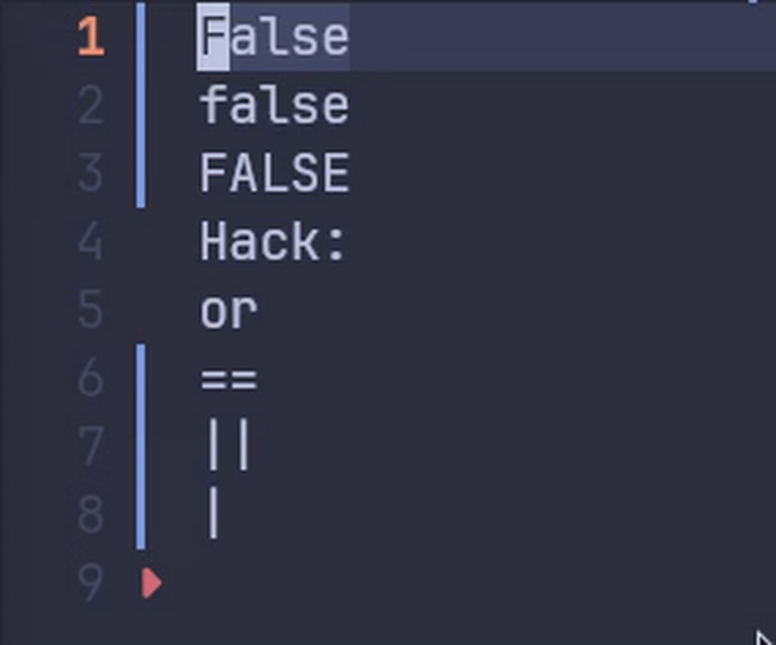

# Micro-word-toggle.nvim

A tiny Neovim plugin to toggle the word under the cursor through common pairs and cycles (true/false, on/off, debug/info/warn/error, etc.).



## Features

- Toggle the current word in place with one command
- Case-aware replacement: `True -> False`, `DEBUG -> INFO`
- Extend or replace the default cycles with your own words

## Requirements

- Neovim 0.7+

## Installation

Using [lazy.nvim](https://github.com/folke/lazy.nvim):

```lua
{
  "Micro-nvim-plugin/Micro-word-toggle.nvim",
  config = function()
    require("Micro-word-toggle").setup()
  end,
}
```

Using [packer.nvim](https://github.com/wbthomason/packer.nvim):

```lua
use({
  "Micro-nvim-plugin/Micro-word-toggle.nvim",
  config = function()
    require("Micro-word-toggle").setup()
  end,
})
```

## Usage

Bind a keymap to `toggle()`:

```lua
vim.keymap.set("n", "<leader>tw", function()
  require("Micro-word-toggle").toggle()
end, { desc = "Toggle word" })
```

## Configuration

Provide extra cycles via `setup({ dict = { ... } })`:

```lua
require("Micro-word-toggle").setup({
  dict = {
    { "enable", "disable" },
    { "start", "stop", "restart" },
    { "left", "right" },
  },
})
```

The dictionary is a list of word groups, and each group forms a cycle.

## Default Cycles

```text
true <-> false
yes <-> no
on <-> off
open <-> close
and <-> or
< <-> >
<= <-> >=
== <-> !=
&& <-> ||
& <-> |
debug -> info -> warn -> error
public -> private -> protected
todo -> fixme -> note -> hack -> bug
```

## License

GLPv3. See `LICENSE`.
